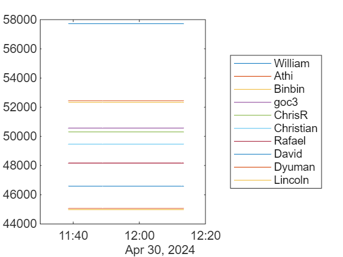

# Daily Cody Leaderboard

You'll need all the profile IDs for the people you want to track.


First time through.

```matlab
profile_ids = [173294 734801 5349647 17355128 1887879 17719399 12862873 15363629 615500 10491973];

s1 = "https://www.mathworks.com/matlabcentral/cody/players?term=id%3A";
s2 = join(string(profile_ids),"+OR+id%3A");
s3 = "&format=json";

url = s1 + s2 + s3;

json = webread(url);

tCurrentScores = struct2table(json)
```
| |profile_id|score|nickname|
|:--:|:--:|:--:|:--:|
|1|173294|57756|'William'|
|2|615500|52444|'Athi'|
|3|734801|52336|'Binbin Qi'|
|4|5349647|50576|'goc3'|
|5|1887879|50341|'ChrisR'|
|6|15363629|49531|'Christian Schröder'|
|7|17355128|48172|'Rafael S.T. Vieira'|
|8|10491973|46626|'David Hill'|
|9|12862873|45071|'Dyuman Joshi'|
|10|17719399|44975|'Lincoln Poon'|

```matlab
tLeaderboard = array2table(tCurrentScores.score');
names = string(tCurrentScores.nickname');
firstNames = regexprep(names," .*","");

tLeaderboard.Properties.VariableNames = firstNames;
tLeaderboard.time = datetime("now")
```
| |William|Athi|Binbin|goc3|ChrisR|Christian|Rafael|David|Dyuman|Lincoln|time|
|:--:|:--:|:--:|:--:|:--:|:--:|:--:|:--:|:--:|:--:|:--:|:--:|
|1|57756|52444|52336|50576|50341|49531|48172|46626|45071|44975|01-May-2024 11:16:09|

```matlab
% writetable(tLeaderboard,'Data/cody_leaders.csv')
```

Following iterations

```matlab
tLeaderboard = readtable("Data/cody_leaders.csv");
json = webread(url);
tCurrentScores = struct2table(json)
```
| |profile_id|score|nickname|
|:--:|:--:|:--:|:--:|
|1|173294|57723|'William'|
|2|615500|52444|'Athi'|
|3|734801|52336|'Binbin Qi'|
|4|5349647|50576|'goc3'|
|5|1887879|50308|'ChrisR'|
|6|15363629|49476|'Christian Schröder'|
|7|17355128|48172|'Rafael S.T. Vieira'|
|8|10491973|46589|'David Hill'|
|9|12862873|45071|'Dyuman Joshi'|
|10|17719399|44975|'Lincoln Poon'|

```matlab
tNewLeaders = array2table(tCurrentScores.score');
tNewLeaders.Properties.VariableNames = firstNames;
tNewLeaders.time = datetime("now");
tLeaderboard = [tLeaderboard; tNewLeaders];
```
| |William|Athi|Binbin|goc3|ChrisR|Christian|Rafael|David|Dyuman|Lincoln|time|
|:--:|:--:|:--:|:--:|:--:|:--:|:--:|:--:|:--:|:--:|:--:|:--:|
|1|57723|52444|52336|50576|50308|49476|48172|46589|45071|44975|30-Apr-2024 11:38:29|
|2|57723|52444|52336|50576|50308|49476|48172|46589|45071|44975|30-Apr-2024 11:48:54|
|3|57723|52444|52336|50576|50308|49476|48172|46589|45071|44975|30-Apr-2024 11:52:46|

```matlab
% writetable(tLeaderboard,'Data/cody_leaders.csv')
```

```matlab
tt = table2timetable(tLeaderboard);
for n = 1:width(tt)
    plot(tt.time,tt.(firstNames(n)))
    hold all
end
hold off
yt = yticks;
set(gca,YTickLabel=string(yt))
legend(firstNames,Location="eastoutside")
```


