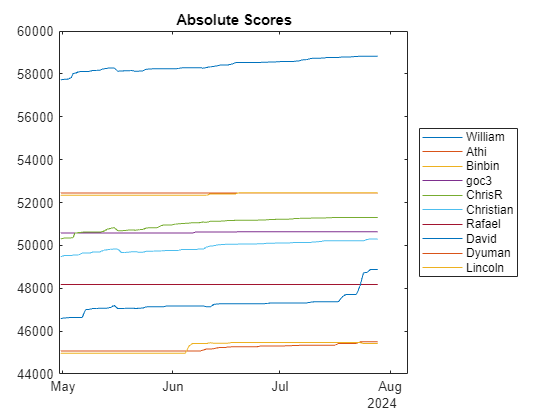
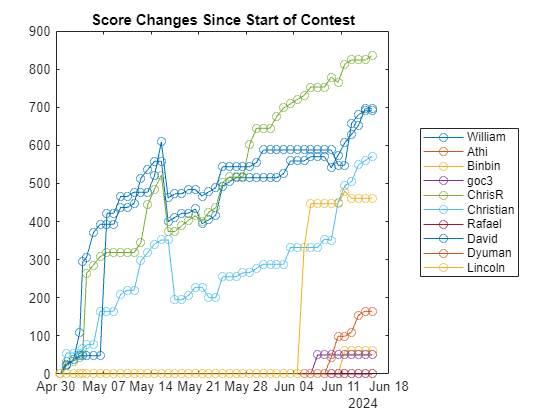

```matlab
tt = readtimetable("Data/cody_leaders.csv");
varNames = tt.Properties.VariableNames;
for n = 1:width(tt)
    plot(tt.time,tt.(n))
    hold all
end
hold off
yt = yticks;
set(gca,YTickLabel=string(yt))
legend(varNames,Location="eastoutside")
title("Absolute Scores")
```



```matlab
for n = 1:width(tt)
    scores = tt.(n);
    plot(tt.time,scores-scores(1),"o-")
    hold all
end
hold off
yt = yticks;
set(gca,YTickLabel=string(yt))
legend(varNames,Location="eastoutside")
title("Score Changes Since Start of Contest")
```


